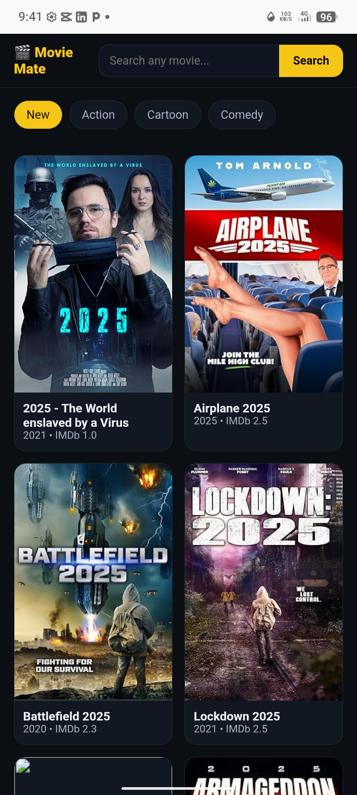

<html lang="en">
<head>
<meta charset="UTF-8">
<meta name="viewport" content="width=device-width, initial-scale=1.0, maximum-scale=1.0">
<title>Gokah Israel</title>
<link href="https://fonts.googleapis.com/css2?family=Poppins:wght@400;600;700&display=swap" rel="stylesheet">

</head>
<body>

<!-- HEADER -->
<header class="app-header">
    
    <h1>GOKAH ISRAEL</h1>
    
Web Developer

    

        HTML
        CSS
        JS
        Python
    

    
📍 Afienya, Greater Accra, Ghana

</header>

<!-- MAIN BUTTONS -->
<a href="https://wa.me/233537254505" class="btn btn-whatsapp">💬 WhatsApp: 0537254505</a>
<a href="#projects" class="btn btn-primary">📱 View My Work</a>

    <!-- ABOUT -->
    

        <h2>👋 About Me</h2>
        

            
I build fast, modern websites for schools, businesses, and startups in Ghana.

            
<b style="color:var(--accent)">I'm very ready to work with you.</b>

        

    

    <!-- SKILLS -->
    

        <h2>⚡ My Skills</h2>
        

            

                HTML5
                CSS3
                JavaScript
                Python
                Responsive
                GitHub
                Web Apps
            

        

    

    <!-- PROJECTS -->
    

        <h2>🚀 My Projects</h2>
        
        

            
            

                <h3>CLOUT SMS</h3>
                
School management system. Students, attendance, report cards, CSV export.

                <a href="https://israelclout.github.io/Tipsy.clout/" target="_blank" class="btn-small">Open App</a>
            

        

        

            
            

                <h3>Movie Mate</h3>
                
Movie discovery app. Browse, search, and view movie ratings.

                <a href="https://israelclout.github.io/Movie-Mate-/" target="_blank" class="btn-small">Open App</a>
            

        

        

            
            

                <h3>Brain-Master</h3>
                
Quiz game with timer, lives, and Ghana GK questions.

                <a href="https://israelclout.github.io/Brain-Master-/" target="_blank" class="btn-small">Play Now</a>
            

        

    

    <!-- SERVICES -->
    

        <h2>🛠️ Services</h2>
        

            
<b>🌐 Business Websites</b> Landing pages that convert visitors to customers

        

        

            
<b>🏫 School Systems</b> Student records, grading, attendance, report cards

        

        

            
<b>⚡ Web Apps</b> Custom dashboards, tools, and interactive apps

        

    

    <!-- CONTACT -->
    

        <h2>📞 Contact</h2>
        

            
<b>Name:</b> Gokah Israel Ewoenam

            
<b>Location:</b> Afienya, Greater Accra

            
<b>WhatsApp:</b> 0537254505

            <a href="https://wa.me/233537254505" class="btn btn-whatsapp" style="margin-top:15px;width:100%">Chat Now</a>
        

    

<!-- BOTTOM NAVIGATION -->
<nav class="bottom-nav">
    <a href="#" class="nav-item active">🏠Home</a>
    <a href="#projects" class="nav-item">📱Projects</a>
    <a href="#" class="nav-item">⚡Services</a>
    <a href="https://wa.me/233537254505" class="nav-item">💬Contact</a>
</nav>

<footer>
    © 2026 Gokah Web Solutions
</footer>

</body>
</html>
